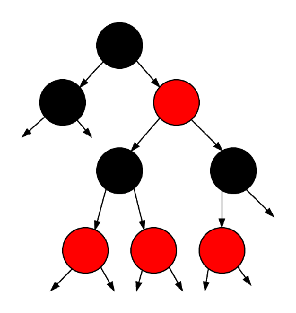

<!-- PROJECT LOGO -->
 

  

<h3 align="center">Word Checker</h3>

  

    Progetto Finale Algoritmi e Principi dell'Informatica (API) 2022 - Politecnico di Milano
  

   

<!-- ABOUT THE PROJECT -->
## World Checker

***Descrizione del problema***

L'obiettivo del progetto è la realizzazione di un sistema che, al suo cuore, controlla la corrispondenza tra le lettere di 2 parole di ugual lunghezza. Le parole sono intese come sequenze di simboli che possono essere caratteri alfabetici minuscoli (a-z) o maiuscoli (A-Z), cifre numeriche (0-9), oppure i simboli - (trattino) e _ (underscore).

Il sistema legge da standard input una sequenza di informazioni e istruzioni, e produce delle stringhe in output a seconda dei casi.

Il sistema legge:

* un valore $k$, che indica la lunghezza delle parole.
* una sequenza di lunghezza arbitraria di parole, ognuna lunga $k$, che costituisce l'insieme di parole ammissibili.
* una sequenza di partite, in cui ogni nuova partita è marcata dal comando `+nuova_partita`.

(<a href="#readme-top">back to top</a>)

## Implementazione

***Descrizione della soluzione***

(<a href="#readme-top">back to top</a>)

<!-- LICENSE -->
## License 📄

Distributed under the `MIT` License. See `LICENSE` for more information.

(<a href="#readme-top">back to top</a>)

