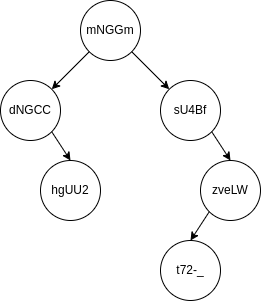

<!-- PROJECT LOGO -->
 

  

<h3 align="center">Word Checker</h3>

  

    Progetto Finale Algoritmi e Principi dell'Informatica (API) 2022 - Politecnico di Milano
  

   

<!-- ABOUT THE PROJECT -->
## Word Checker

L'obiettivo del progetto è la realizzazione di un sistema che, al suo cuore, controlla la corrispondenza tra le lettere di 2 parole di ugual lunghezza. Le parole sono intese come sequenze di simboli che possono essere caratteri alfabetici minuscoli (a-z) o maiuscoli (A-Z), cifre numeriche (0-9), oppure i simboli - (trattino) e _ (underscore).

Il sistema legge da standard input una sequenza di informazioni e istruzioni, e produce delle stringhe in output a seconda dei casi.

Il sistema legge:

* un valore $k$, che indica la lunghezza delle parole.
* una sequenza di lunghezza arbitraria di parole, ognuna lunga $k$, che costituisce l'insieme di parole ammissibili.
* una sequenza di partite, in cui ogni nuova partita è marcata dal comando `+nuova_partita`.

Ogni partita è formata da:

* parola di riferimento (quella che deve essere indovinata);
* numero $n$ massimo di parole da confrontare con la parola di riferimento;
* sequenza di parole da confrontare con quella di riferimento.

Ogni tanto, nella sequenza può comparire il comando `+stampa_filtrate` che stampa il tutte le parole che possono essere la parola di riferimento, basandosi sui vincoli appresi nel corso dei tentativi effettuati.

Inoltre, sia durante una partita che tra una e l'altra, possono comparire i comandi `+inserisci_inizio` e `+inserisci_fine` che racchiudono tra di loro una sequenza di nuove parole da aggiungere all'insieme di quelle ammissibili.

Per ogni parola in input viene generato un output. Siano $r$ la parola di riferimento e $p$ la parola letta dalla sequenza. L'output $res$ sarà formato come segue:

* $res[i] = +$ se $p[i] = r[i]$;
* $res[i] = /$ se $p[i]$ non compare in nessuna posizione in r;
* $res[i] = |$ se $p[i]$ compare in r ma non è in posizione corretta. Tuttavia, se in $r$ compaiono $n_i$ istanze di $p[i]$, se $c_i$ è il numero di istanze del carattere $p[i]$ che sono in posizione corretta e se ci sono prima del carattere i-esimo in $p$ almeno $n_i - c_i$ caratteri uguali a $p[i]$ che sono in posizione scorretta, allora $res[i]$ deve essere $/$ invece che $|$.

(<a href="#readme-top">back to top</a>)

## Implementazione

Il programma è stato sviluppato in C.

Per l'implementazione sono state utilizzate due tipologie di strutture dati: Binary Search Tree e Linked List.

Il primo viene utilizzato per memorizzare tutte le parole che sono state inserite e rappresenta l'insieme di parole ammissibili e la sua esistenza perdura fino a quando il programma non termina. Ho deciso di utilizzare un BST per risparmiare tempo in inserimento e ricerca di nodi nell'albero. Un'altra possibilità è rappresentata dai Red and Black Tree (RB-Tree) ma non portano a notevoli benefici rispetto alla scelta adottata, quindi per semplicità non è stato inserito l'autobilanciamento dei rami dell'albero.

La Linked List, a differenza del BST, esiste solo quando una partita è in corso. Essa però non viene inizializzata non appena viene letto il comando `+nuova_partita`, ma quando viene letta la prima parola dalla sequenza di stringhe che mirano ad indovinare la parola di riferimento. La scelta è stata dettata dal fatto che copiare l'intero BST all'interno della lista e rileggerla tutta per il filtraggio dei nodi portava ad una notevole perdita di tempo. Per questo motivo, si controlla se la parola in ingresso sia la prima della sequenza di tentativi: se lo è, ogni nodo del BST viene confrontato coi vincoli appresi e, se li rispetta, viene aggiunto alla lista, altrimenti si passa al nodo successivo.

Come appena accennato, i vincoli che vengono appresi nel corso della partita vengono salvati. In particolare, essi sono memorizzati all'interno di tre matrici:

* `char yon[ALPHABET_SIZE][k]`: acronimo di "yes-or-no", salva in `yon[i][j]` 'y' se la l'ASCII della lettera c mappata in $i$ può trovarsi in posizione $j$, altrimenti salva 'n'. Inizialmente, la matrice è inizializzata tutta a 'd' (don't know);
* `int mae[ALPHABET_SIZE][2]`: acronimo di "minimum-and-equal". La prima colonna indica il numero minimo di volte in cui la lettera mappata in $i$ deve comparire nella soluzione; la seconda colonna indica il numero esatto di volte in cui essa debba comparire. La matrice è inizialmente inizializzata a -1 in tutte le sue celle. Ovviamente, se nella seconda colonna si hanno valori diversi da -1, essi introducono un vincolo molto più forte di quello della prima colonna;
* `int oar[ALPHABET_SIZE][2]`: acronimo di "occurrences-and-repetitions". Nella prima colonna vengono salvati il numero di volte che ogni lettera compare nella parola di riferimento, mentre nella seconda colonna si salvano le volte in cui $p[i] = r[i]$.

`yon` e `mae` vengono usati per il filtraggio di parole per il comando `+stampa_filtrate`, mentre `oar` viene utilizzato per la generazione dell'output.

Per maggiori dettagli sull'implementazione, potete trovare il codice [qui](src/main.c).

(<a href="#readme-top">back to top</a>)

## License 📄

Distributed under the `MIT` License. See `LICENSE` for more information.

(<a href="#readme-top">back to top</a>)

